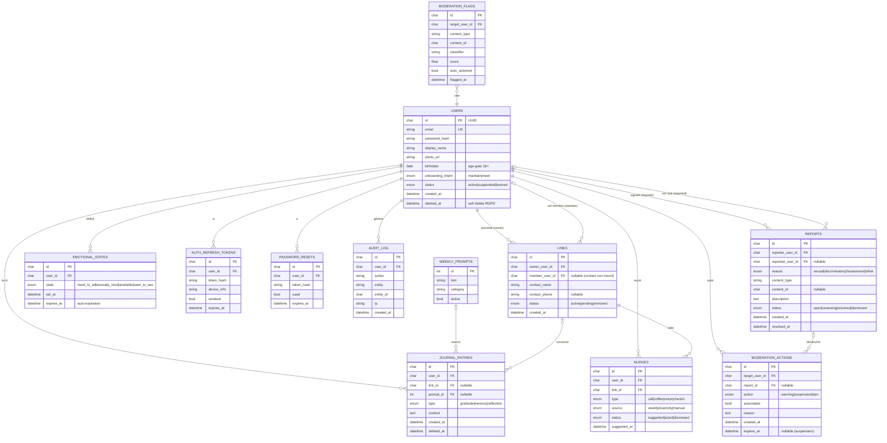

# Architecture & Schéma BDD — MVP
### (nom de travail : « Cercle »)

---

## 1. Vue d'ensemble

```
┌─────────────────────────────┐
│   App React Native + Expo   │   iOS · Android · Web
│   (TS strict, Expo Router)  │
└──────────────┬──────────────┘
               │ HTTPS / JWT
               │ WebSocket (états émotionnels temps réel)
┌──────────────▼──────────────┐
│   API Express.js (Node TS)  │
│   • Auth (JWT access+refresh)│
│   • Routes métier + middlewares rôles
│   • Socket.io (realtime)    │
│   • Couche modération       │
└───┬───────────┬─────────┬───┘
    │           │         │
┌───▼───┐  ┌────▼────┐  ┌─▼──────────────┐
│ MySQL │  │ Object  │  │ Modération API │
│ (BDD) │  │ Storage │  │ (image + texte)│
└───────┘  │ (photos)│  └────────────────┘
           └─────────┘
    + Push notifications (Expo Notifications)
```

**Choix de stack :** Express + MySQL (ton terrain). *Alternative accélérateur : Supabase (Postgres + auth + realtime + storage + RLS clés en main) — le schéma ci-dessous reste valable, à quelques détails près (UUID natif, ENUM, RLS au lieu d'autorisation applicative).*

---

## 2. Diagramme ER



---

## 3. Détail des tables (MVP — 12 tables)

**users** — comptes. `password_hash` en Argon2 (comme Pikit). `birthdate` sert l'age-gate 18+. `deleted_at` = soft delete pour le droit à l'oubli RGPD. `status` gère suspension/ban.

**links** — le Cercle. Point clé : un lien pointe soit vers un **utilisateur inscrit** (`member_user_id`), soit vers un **contact non inscrit** (`contact_name` + `contact_phone`). C'est ce qui permet l'usage **solo** (cf. décision « couche au-dessus » de la spec). Les features partagées (états émotionnels, souvenirs co-écrits) ne s'activent que si `member_user_id` est renseigné **et** réciproque.

> **Contrainte « 3 max »** : à enforcer côté appli + idéalement un **trigger** `BEFORE INSERT` qui compte les `links` actifs de l'`owner` et bloque au-delà de 3 (tu as déjà fait des triggers de conflit sur Pikit).

**weekly_prompts** — catalogue des questions douces (seed data). `active` permet de faire tourner/désactiver des prompts.

**journal_entries** — le journal relationnel. `prompt_id` non nul = entrée issue de la question hebdo (boucle question → journal). `link_id` non nul = entrée à propos d'une personne précise (alimente les nudges).

**nudges** — les relances douces. `source` trace l'origine (hebdo / inactivité / manuelle). **Aucune notion de streak** — volontaire. `status = acted` mesure un critère de succès du MVP.

**emotional_states** — états privés. `expires_at` **obligatoire** : un « fatigué socialement » ne doit pas rester collé indéfiniment. Visible uniquement par le cercle réciproque.

**reports** — signalements. `reason` couvre explicitement *sexual* et *discriminatory*. Polymorphe via `content_type` + `content_id`.

**moderation_actions** — sanctions graduées. `automated = true` quand déclenché par la couche auto ; sinon `moderator_id` (humain). `expires_at` pour les suspensions temporaires.

**moderation_flags** — sortie de la modération automatique à l'upload (score du classifieur image/texte). Au-delà d'un seuil → action auto + mise en file de revue humaine.

**auth_refresh_tokens** — JWT refresh (access + refresh, comme Pikit). Hash stocké, jamais le token en clair. `revoked` pour invalidation.

**password_resets** — reset par email (comme Pikit). Token hashé, à usage unique, expirant.

**audit_log** — journal d'audit (comme Pikit). Sert aussi de preuve pour la modération et la conformité.

---

## 4. Sécurité & règles d'accès

- **Auth** : JWT access court (~15 min) + refresh long, rotation des refresh tokens, hash Argon2 des mots de passe.
- **Autorisation** : middlewares de rôle (user / moderator / admin). Un user ne lit/écrit QUE ses propres `journal_entries`, `nudges`, `emotional_states`. Les états émotionnels ne sont lisibles que par les membres du cercle réciproque.
- *(Sur Supabase, ces règles deviennent des policies Row-Level Security au lieu d'autorisation applicative.)*
- **Photos** : stockées en object storage, jamais en base — la table ne garde que `photo_url`. Accès signé/expiring.
- **Rate limiting** + protection anti-bot sur auth, signalement, upload.

---

## 5. RGPD

- **Soft delete** (`deleted_at`) puis purge définitive par job planifié → droit à l'effacement complet.
- Suppression du compte = anonymisation/suppression des `journal_entries`, `emotional_states`, photos, et purge des refresh tokens.
- Consentement explicite à l'upload de photo (donnée personnelle).
- L'`audit_log` conserve le strict nécessaire, avec durée de rétention bornée.

---

## 6. Temps réel & push

- **Socket.io** (ton acquis Pikit) : push des changements d'`emotional_states` vers le cercle réciproque, en direct.
- **Expo Notifications** pour les rappels — **doux, non agressifs** : la question hebdo, jamais de spam. Respect du silence numérique (pas de relance si le user a coupé / est en retrait).

---

## 7. Stubs V2 (à ne PAS construire maintenant)

- **matching** : tables `match_candidates`, `match_states` avec statut *forming* vs *established* (le verrou à 3 distingue lien en formation et lien établi).
- **subscriptions / billing** : plan premium, statut d'abonnement, historique de paiement.
- **photo verification** : table `identity_checks` (selfie / liveness) pour transformer la photo en vraie preuve, indispensable avant d'ouvrir la rencontre.
